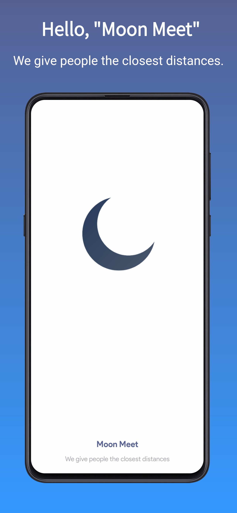
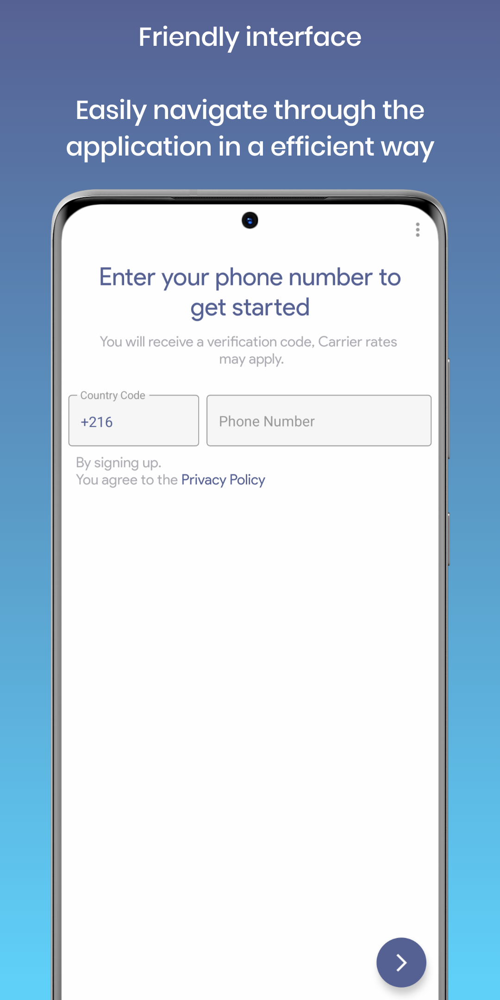
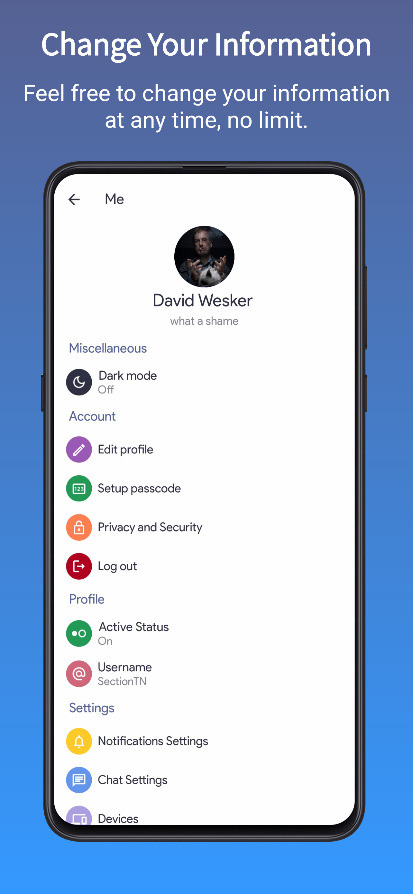
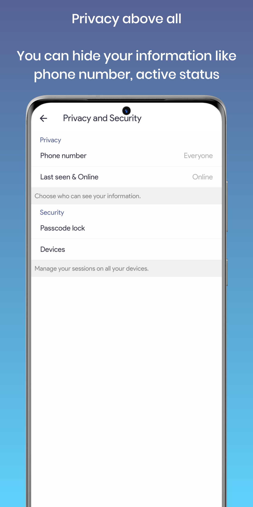
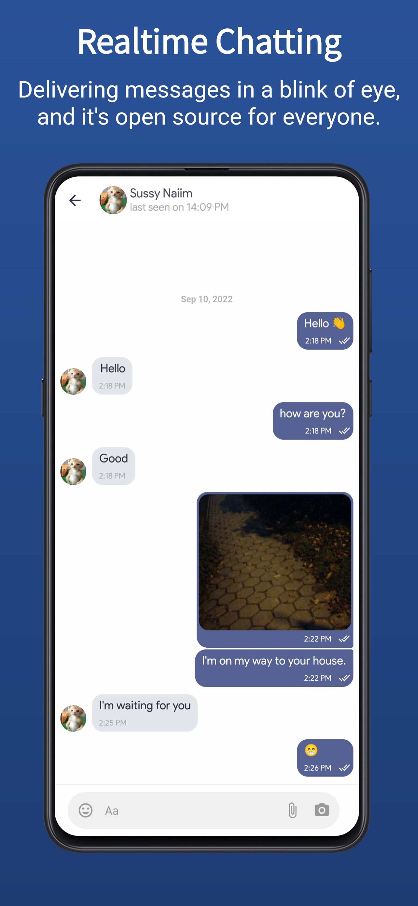

### MoonMeet CrossPlatform

<p>


</p>
- We give people the closest distances

### Description

- **Moon Meet** is a social media platform including chatting feature.
- **Moon Meet** is a platform formed with Mobile Android App.
- **Moon Meet** is licensed under the GNU GPL License 3.0.
- **Moon Meet** is an Open Source Project means that anyone can see, change, get the source code and can contribute to make this project more better.
- **Moon Meet** nothing with its contributors, so let's contribute together to make it alive !

### Screenshots

<p float="left">



<p>
<p float="right">



<p>

### Contributing

#### Requirments:

---

- A Working react native envirment environment.
- Physical device (real device) because emulators have problem with SHA-256.
- NDK Version `21.4.7075529`, NOTE: for Mac M1 users, you'll just need NDK version `24.0.8215888`.
- SDK Version `33, 32, 31 and 30`.
- ICU for linux (optional):
  
  ```
  git clone https://github.com/unicode-org/icu
  cd icu/icu4c
  cd source
  ./configure --prefix=/usr
  make
  sudo make install
  ```
- Your own `release.keystore, sensitive.js and google-service.json`.

---

##### Troubleshooting:

---

- `[TASK] react-native-compressor-verifyReleaseRessources [FAILED] in release mode:`
  fix: Go to `node_modules/react-native-compressor/android.build.gradle` and change `compileSdkVersion to 33`,`targetSdkVersion to 24` and `buildToolVersion to "33.0.0"`.
- `[TASK] bundleReleaseJsAndAssets [FAILED]:`
  fix: use android studio and the following command `./gradlew clean && ./gradlew --stop && ./gradlew assembleRelease --no-daemon`.

### Commit message

When you've made changes to one or more files, you have to *commit* that file. You also need a *message* for that *commit*.

You should read these guidelines:
https://www.freecodecamp.org/news/writing-good-commit-messages-a-practical-guide/

And that summarized:

- Short and detailed
- Prefix one of these commit types:
  - `feat:` A feature, possibly improving something already existing
  - `fix:` A fix, for example of a bug
  - `style:` Feature and updates related to styling
  - `refactor:` Refactoring a specific section of the codebase
  - `test:` Everything related to testing
  - `docs:` Everything related to documentation
  - `chore:` Code maintenance (you can also use emojis to represent commit types)

**Examples:**

- `feat: Improve end-to-end encryption `
- `fix: Fix story not showing in some browsers`
- `refactor: Reformat code at File.*`
- `chore: bump Moon Meet version from X.X.X to X.X.X `
- ...

### Thanks for contributing

Thanks, they help to keep **Moon Meet** alive. It's better to have multiple people work on a project, for more ideas, less bugs. (sadly sometimes more), and generally quicker development. Each (helpful) contribution that gets thankfully accepted.

### Social

- [Facebook](https://www.facebook.com/moonmeetofficial)
- [Telegram](https://t.me/MoonMeet)

### License

```
Copyright (C) 2022  SectionTN

This program is free software: you can redistribute it and/or modify
it under the terms of the GNU General Public License as published by
the Free Software Foundation, either version 3 of the License, 
or any later version.

This program is distributed in the hope that it will be useful,
but WITHOUT ANY WARRANTY; without even the implied warranty of
MERCHANTABILITY or FITNESS FOR A PARTICULAR PURPOSE.See the
GNU General Public License for more details.
```

